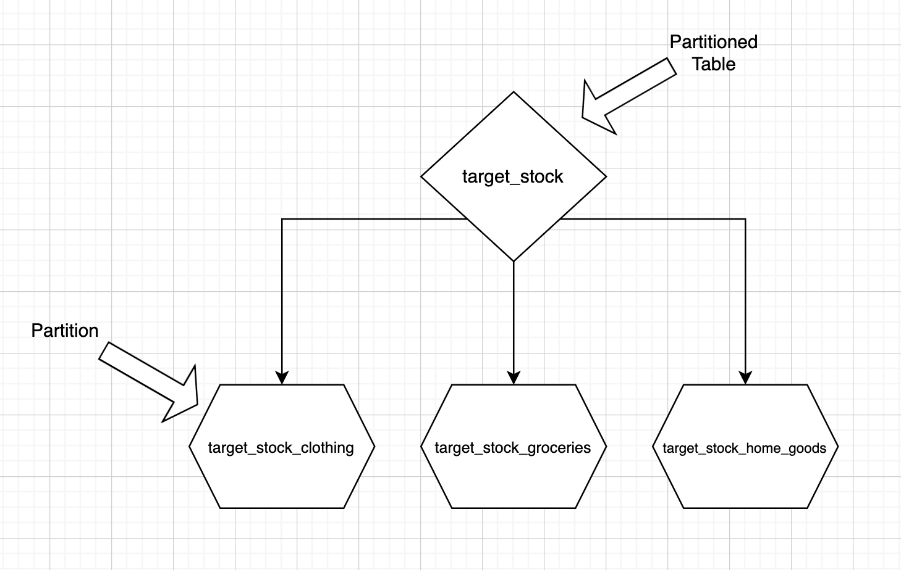
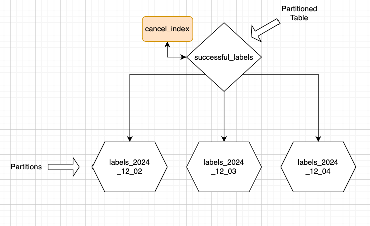

## Postgres Partitions: Lessons Learned

#### Kelsi Wolter
#### Alex Kuznetsov

---

## Terms

Partitioned Table:  
```CREATE TABLE target_stock PARTITION BY LIST (department)```
Partitions:  
```CREATE TABLE target_stock_clothing PARTITION OF target_stock FOR VALUES IN (clothing)```
Data:  
```INSERT INTO target_stock VALUES ('shirt', 'clothing')```



---

## TL/DR: Partitioned Tables

* highly useful in some cases.
* not the best fit in other ones - the solution causes more problems than it solves.
* can create an index on a large table without downtime.

---

## Pros Of Partitioned Tables

* Purge old data by dropping a partition, no `VACUUM`, no impact on server's performance
* Large data loads done without much impact on server's performance

---

## Large Data Load Without Impact On Server's Performance

* Load data into a new partition
* Can be throttled, less impact on server's performance
* Switch reads to new partition

---
insert slide about example in service availability?
---

## Cons Of Partitioned Tables

* Must create partitions manually - and take care to handle race condition errors
* Some queries are slower
* Need to write SQL to ensure uniqueness, vs `UNIQUE` constraint/index
* Need to write SQL to implement `UPSERT` vs simple `INSERT ... ON CONFLICT(...) DO UPDATE`
* And more...

---

## Race Condition Creating Partitions

```sql
CREATE TABLE IF NOT EXISTS ...
```

* Safely runs consecutively
* But if two sessions run it concurrently, one might fail
* Exactly at midnight, two sessions try to create same partition for today

---
insert slides about solution?
catching the exception and not alerting
---

## Some Queries Are Slower

```sql
SELECT * FROM packages WHERE tracking_number = '123456'
-- we have no idea which partition to look in
```

* Without partitioning: 1 index seek
* With partitioning: 1 index seek per partition
* Even though partitions are smaller, the total time is longer
* In fact, 1 index seek in one partition may be just as fast as 1 index seek in the whole table
* Or slightly faster, not by much

---

## Counterintuitive? Let's Take A Look.

---
## Cost Of Index Seek = Number Of Pages Read

* Oversimplified, but good enough for our purposes


---

## Table Grows, Cost Of Index Seek Stays The Same

* Number Of Pages Read = Logarithm Of Table Size
* Table Can Grow 20-30 Times, Cost Of Index Seek Stays The Same
* It Cuts Both Ways - Table Can Shrink, Cost Of Index Seek Can Stay The Same

---

## Table Gets Divided Into 15 Partitions
* Maybe the cost of index seek is the same for the whole table and one partition
* Or slightly less for partition, not by much
* Overall, the cost of 15 index seeks is much higher

---

## Solution - Less Partitions

* partition per month or at least per week
* need more storage
* much faster queries
* typical trade-off in Postgres - more storage for faster queries

---

## Next Problem: Uniqueness

#### Suppose we have a partitioned table

```sql
CREATE TABLE packages (
    tracking_number TEXT NOT NULL, 
    ...
) PARTITION BY RANGE (shipped_date);
```

#### Cannot create a unique index on `tracking_number`

```sql
CREATE UNIQUE INDEX packages__tracking_number__unq 
ON packages(tracking_number)
```

---

## Can Only Create Unique Index On Each Partition

```sql
CREATE UNIQUE INDEX packages__tracking_number__unq 
ON packages(tracking_number, shipped_date)
```



---

## Must Write SQL To Enforce Uniqueness

```sql
-- SERIALIZABLE isolation level is a must, slow

INSERT INTO packages(tracking_number, shipped_date, ...)
SELECT :tracking_number, :shipped_date, ...
WHERE NOT EXISTS(
    SELECT * FROM packages -- all partitions, slow
    WHERE tracking_number = :tracking_number
)
```

---

## We Could Go On...

##### But The Point Is Clear Already

### Partitions Are Expensive
### Use Them After Careful Consideration

---

## Partition Pro: Create Index On Large Table Without Downtime

* usual way of creating an index:

```sql
CREATE INDEX packages__tracking_number
ON packages(tracking_number)
```
* issues with this approach:
  * table is read only for a long time
  * server is very busy, slower responses

---

## TRY CONCURRENTLY? DOES NOT WORK

```sql
CREATE INDEX CONCURRENTLY packages__tracking_number
ON packages(tracking_number)
```
* table is available for modifications
* server is very busy, slower responses
* usually fails
* need to retry manually, many times
* no guarantee of success ever

---

## Alternatively, Build A New Table And Migrate To It


---

## It Works, But Too Much Busywork

* create a new table with new index
* app must write to both tables
* need to migrate all data to new table
* need to switch reads/writes to new table
* drop old table
