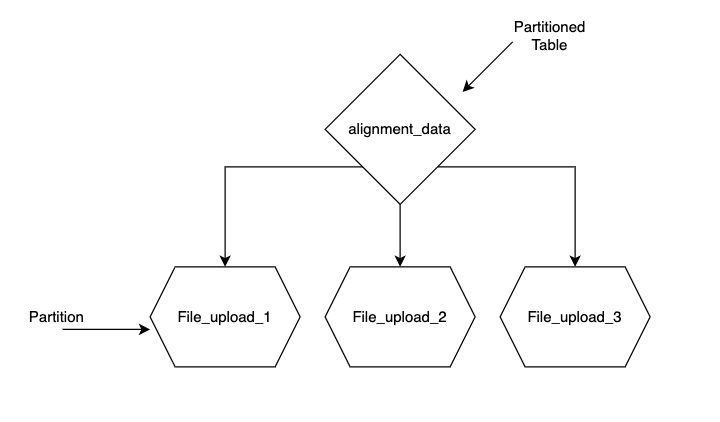
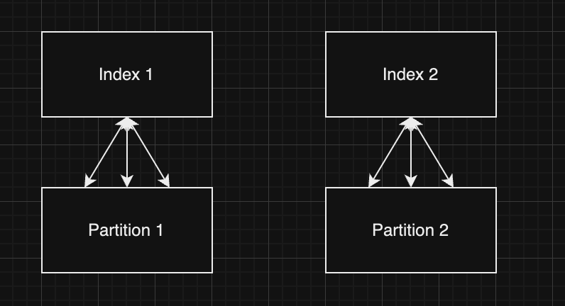
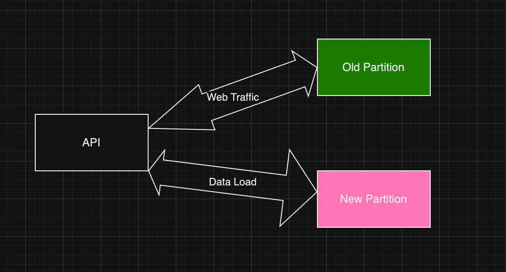
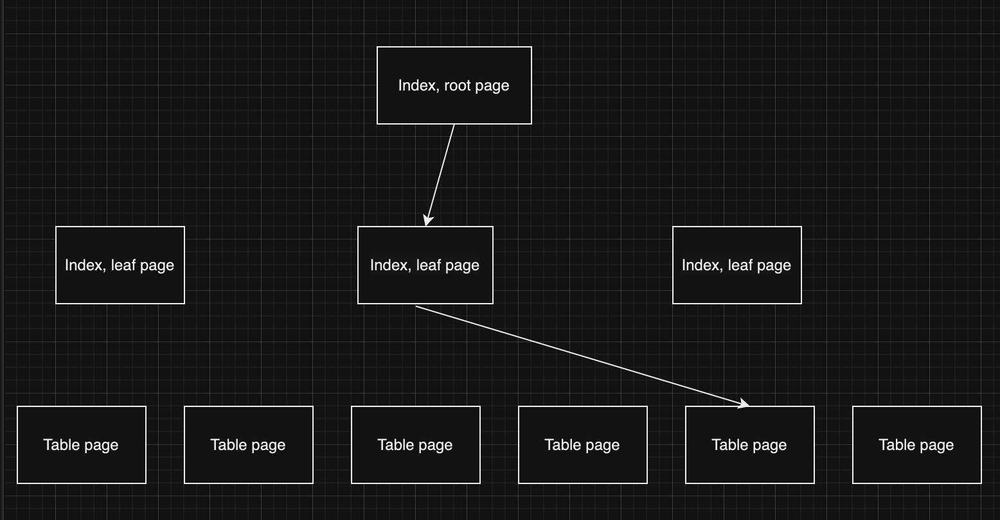
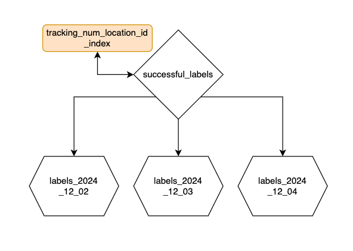

## Postgres Partitions: Lessons Learned

#### Kelsi Wolter
#### Alex Kuznetsov

---

## Terms

Partitioned Table:  
```
CREATE TABLE alignments PARTITION BY LIST (file_upload_id)
```  
Partitions:  
```
CREATE TABLE alignments_file_upload_1 
PARTITION OF alignments FOR VALUES IN (1)
```  
Data:  
```
INSERT INTO alignments(upload_id, destination)
VALUES (1, '55305')
```  



---

## TL/DR: Partitioned Tables

* Pro: highly useful in some cases.
* Con: not the best fit in other ones - the solution causes more problems than it solves.
* Pro: can create an index on a large table without downtime.
* Q&A at the end.

---

## Why Partitioned Tables?

- rows in Postgres are immutable
```sql
UPDATE fruit SET color = 'red' WHERE name = 'apple'
```

| name | size | color | state           |
|------|------|-------|-----------------|
| apple|  small | green | for VACUUM      |
| apple|  small | red   | current version |

- large `UPDATE` or `DELETE` creates more stale rows
- more work for `VACUUM`, like garbage collection
- `VACUUM` can disrupt the whole server

---

## Massive UPDATE Or DELETE causes poor performance of the whole server 
* `VACUUM` uses a lot of resources, slow
* There is a better way - partitioned tables
* Do not `DELETE` - drop a partition, fast
* Do not `UPDATE` - insert into a new partition, drop old one, fast

---

## Partitioned Table itself stores no data

* Just a pattern for creating partitions


---

## partitions store data

- under the hood, each partition is a separate table
- its own indexes, constraints, etc.



---
## Successful Usage Of Partitioned Tables
* Many INSERTS/DELETEs, easy on server
* Insert lots of data, drop partition in a few days
* we have about a dozen of such tables, works great


---

#### Large UPDATE, easy on server

* Insert data into a new partition, can be throttled, no VACUUM
* We have such a system, happy
* Can easily compare two versions and rollback



---

## Partitioned Tables Are Not Always The Best Solution

* We have a system where we considered partitioned tables, but decided against them
* There are downsides
* Sometimes the solution causes more problems than it solves

---

## Cons Of Partitioned Tables

* Must create partitions manually
  * May have to handle race condition errors
* Some queries are slower
* Need to write SQL to ensure uniqueness, vs `UNIQUE` constraint/index
* And more...

---

##### Race Condition Creating Partitions Optimistically

```sql
CREATE TABLE IF NOT EXISTS ...
```

* Safely runs consecutively
* But if two sessions run it concurrently, one might fail
* Exactly at midnight, two sessions try to create same partition for today - COLLISION
* Solution: catch and ignore this specific error

---

## Some Queries Are Slower

```sql
SELECT * FROM packages WHERE tracking_number = '123456'
-- we have no idea which partition to look in
```

* Without partitioning: 1 index seek
* With partitioning: 1 index seek per partition
* Even though partitions are smaller, the total time is longer
* In fact, 1 index seek in one partition may be just as fast as 1 index seek in the whole table
* Or slightly faster, not by much

---

## Counterintuitive? Let's Take A Detailed Look.

---
## Cost Of Index Seek = Number Of Pages Read

* Oversimplified, but good enough for our purposes



---

## Table Grows, Cost Of Index Seek Stays The Same

* Number of pages read = logarithm of table size
* Table can grow 20-30 times, cost of index seek stays the same
* Eventually, cost of index seek will increase, not by much
* It cuts both ways - table can shrink, cost of index seek can stay the same

---

## WHEN Table Gets Divided Into Many Partitions
* Maybe the cost of index seek is the same for the whole table and one partition
* Or slightly less for partition, not by much
* Overall, the cost of many index seeks is much higher

---

## Solution - Less Partitions

* do not partition per day
* partition per month or at least per week
* need more storage
* much faster queries
* typical trade-off in Postgres - more storage for faster queries

---

## Next Problem: Uniqueness

#### Suppose we have a partitioned table

```sql
CREATE TABLE packages (
    tracking_number TEXT NOT NULL, 
    ...
) PARTITION BY RANGE (shipped_date);
```

#### Cannot create a unique index on `tracking_number`

```sql
CREATE UNIQUE INDEX packages__tracking_number__unq 
ON packages(tracking_number)
```

---

## Can Only Create Unique Index On Each Partition

```sql
CREATE UNIQUE INDEX packages__tracking_number__unq 
ON packages(tracking_number, shipped_date)
```



---

## Must Write SQL To Enforce Uniqueness

```sql
-- SERIALIZABLE isolation level is a must, slow

INSERT INTO packages(tracking_number, shipped_date, ...)
SELECT :tracking_number, :shipped_date, ...
WHERE NOT EXISTS(
    SELECT * FROM packages -- all partitions, slow
    WHERE tracking_number = :tracking_number
)
```

---

## Must Use SERIALIZABLE Isolation Level

- make sure the outcome does not change for the life of the transaction
- more work for server, slower
```sql
WHERE NOT EXISTS(
    SELECT * FROM packages -- all partitions, slow
    WHERE tracking_number = :tracking_number
)
```
---

## We Could Go On...

* But the point is clear already
* We have systems where partitioned tables are highly useful
* Also we have systems were partitioned tables are not the best fit
* Too difficult to ensure uniqueness, slower queries, etc.

---

## Partition Pro: Create Index On Large Table Without Downtime

* usual way of creating an index on regular table:

```sql
CREATE INDEX packages__tracking_number
ON packages(tracking_number)
```
* issues with this approach:
  * regular table is read only for a long time - unacceptable
  * server is very busy, slower responses

---

## TRY CONCURRENTLY? DOES NOT WORK

```sql
CREATE INDEX CONCURRENTLY packages__tracking_number
ON packages(tracking_number)
```
* regular table is available for modifications
* server is very busy, slower responses
* usually fails
* need to retry manually, many times
* no guarantee of success ever

---

## Alternatively, Build A New Table And Migrate To It


---

## It Works, But Too Much Busywork

* create a new regular table with new index
* app must write to both regular tables
* need to migrate all data to new table
* need to switch reads/writes to new table
* drop old regular table
* MUCH easier with partitions
